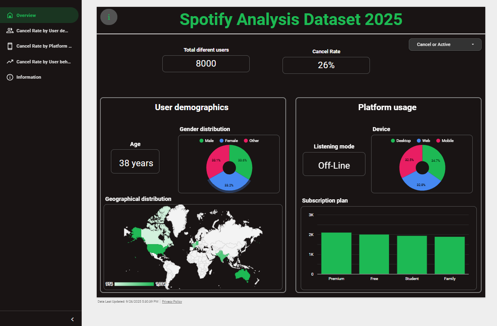

# Spotify-Analysis-Dataset-2025

This project explores Spotify user behavior to identify potential **churn patterns** (subscription cancellations).  
It includes an **interactive dashboard** displaying key insights such as:  
- Age, gender, and geographic distribution.  
- Subscription plans and device usage.  
- Daily listening behavior.  
- Comparison of churned vs non-churned users.  

📈 Dashboard is available in the following link: https://lookerstudio.google.com/reporting/6e200099-8129-4309-9782-7086efa24106/page/p_6q60818lwd

  

---

## 📊 Dataset

The dataset comes from Kaggle:  
[Spotify Dataset for Churn Analysis](https://www.kaggle.com/datasets/nabihazahid/spotify-dataset-for-churn-analysis)

- **Source**: Kaggle  
- **Dataset License**: [Apache 2.0 License](https://www.apache.org/licenses/LICENSE-2.0)  
- ⚠️ **Note**: This repository does **not** redistribute the dataset. To use it, please download it directly from Kaggle.  

---

## ⚙️ Installation & Usage

1. Clone this repository:
   ```bash
   git clone https://github.com/yourusername/spotify-churn-dashboard.git
   cd spotify-churn-dashboard
